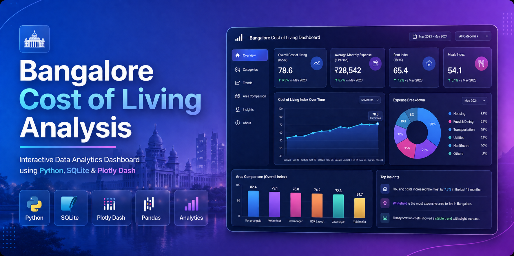
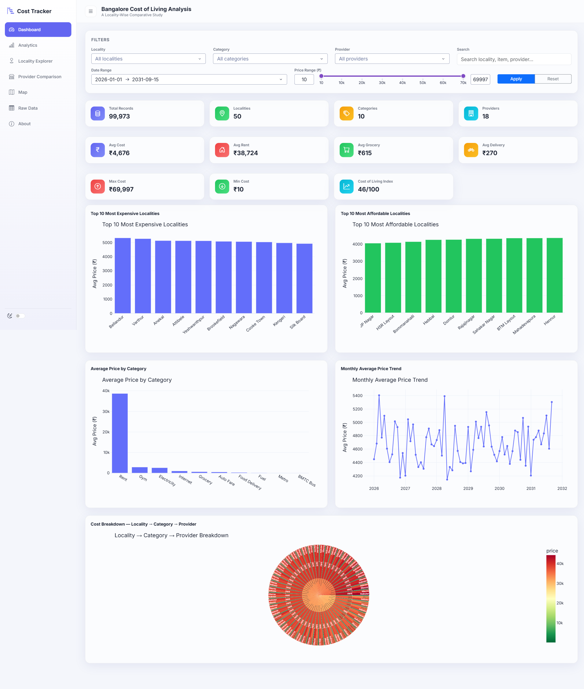
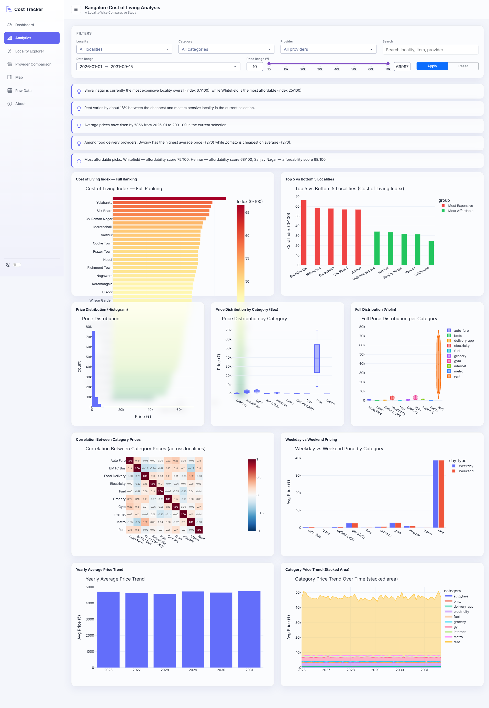
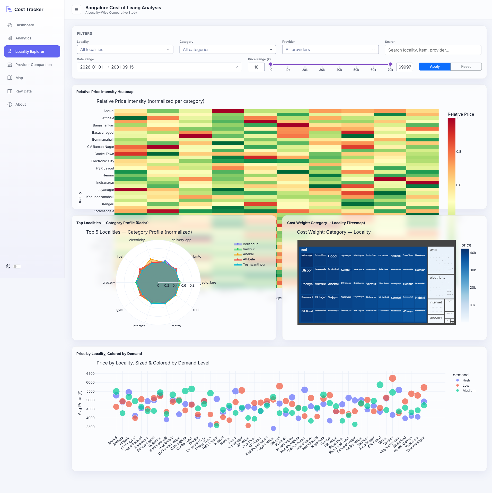
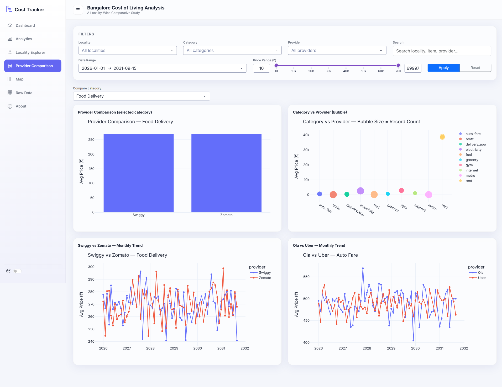
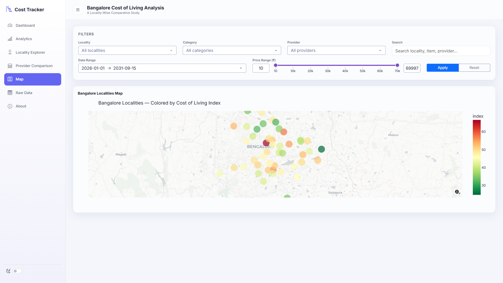
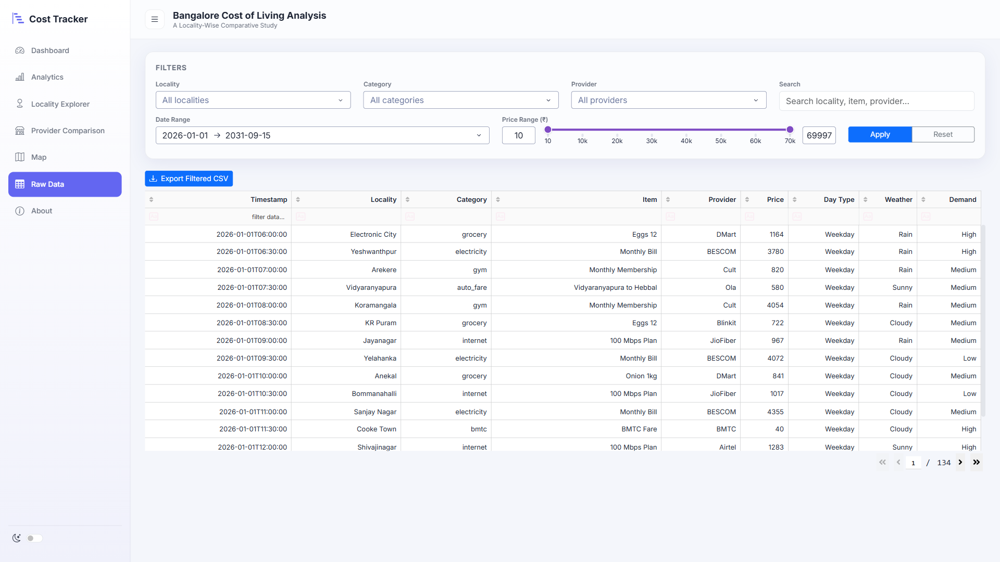

readme_content = '''<div align="center">

<!-- ═══════════════════════════════════════════════════════════════ -->
<!--                        HERO BANNER                              -->
<!-- ═══════════════════════════════════════════════════════════════ -->



<br>

<!-- ═══════════════════════════════════════════════════════════════ -->
<!--                        TYPING ANIMATION                         -->
<!-- ═══════════════════════════════════════════════════════════════ -->


<br>

<!-- ═══════════════════════════════════════════════════════════════ -->
<!--                        BADGES                                   -->
<!-- ═══════════════════════════════════════════════════════════════ -->


<br>


<br>


<br><br>

<!-- ═══════════════════════════════════════════════════════════════ -->
<!--                    SHORT PROJECT DESCRIPTION                    -->
<!-- ═══════════════════════════════════════════════════════════════ -->

<p align="center">
  <b>🎯 An end-to-end Data Analytics platform analyzing Bangalore's cost of living through interactive visualizations, 
  <br>statistical insights, and geospatial mapping — powered by 100,000 synthetic records across 50 localities.</b>
</p>

<p align="center">
  <a href="https://github.com/bhuvansm69-crypto/bangalore-cost-of-living-analysis"><strong>⭐ Star the Repo</strong></a> •
  <a href="https://github.com/bhuvansm69-crypto/bangalore-cost-of-living-analysis/issues"><strong>🐛 Report Bug</strong></a> •
  <a href="https://github.com/bhuvansm69-crypto/bangalore-cost-of-living-analysis/pulls"><strong>🤝 Contribute</strong></a>
</p>

</div>

---

<!-- ═══════════════════════════════════════════════════════════════ -->
<!--                      HIGHLIGHTS SECTION                         -->
<!-- ═══════════════════════════════════════════════════════════════ -->

## ✨ Highlights

> <div align="center">
>
> | 🏆 | **100K+ Records** | Synthetic dataset with realistic distributions |
> |:--:|:--|:--|
> | 🗺️ | **50 Bangalore Localities** | From Koramangala to Whitefield, fully mapped |
> | 📊 | **12+ Interactive Charts** | Plotly-powered with cross-filtering support |
> | 🎯 | **11 KPI Cards** | Real-time metrics at a glance |
> | 🌙 | **Dark Mode + Glassmorphism** | Premium UI experience |
> | 📱 | **Mobile Responsive** | Dashboard works on any device |
> | 🔍 | **Advanced Filtering** | Search, date ranges, multi-select |
> | 📤 | **CSV Export** | Download any view instantly |
>
> </div>

---

<!-- ═══════════════════════════════════════════════════════════════ -->
<!--                    TABLE OF CONTENTS                            -->
<!-- ═══════════════════════════════════════════════════════════════ -->

## 📑 Table of Contents

| Section | Description | Link |
|:--------|:------------|:----:|
| 1 | Overview | [Jump ↗](#-overview) |
| 2 | Features | [Jump ↗](#-features) |
| 3 | Dashboard Preview | [Jump ↗](#-dashboard-preview) |
| 4 | Dataset Summary | [Jump ↗](#-dataset-summary) |
| 5 | Project Statistics | [Jump ↗](#-project-statistics) |
| 6 | Categories Covered | [Jump ↗](#-categories-covered) |
| 7 | Tech Stack | [Jump ↗](#-tech-stack) |
| 8 | Versions | [Jump ↗](#-versions) |
| 9 | Project Structure | [Jump ↗](#-project-structure) |
| 10 | SQL Analytics | [Jump ↗](#-sql-analytics) |
| 11 | Dashboard Modules | [Jump ↗](#-dashboard-modules) |
| 12 | Installation | [Jump ↗](#-installation) |
| 13 | Running Dashboard | [Jump ↗](#-running-dashboard) |
| 14 | Key Insights | [Jump ↗](#-key-insights) |
| 15 | Future Roadmap | [Jump ↗](#-future-roadmap) |
| 16 | Contributing | [Jump ↗](#-contributing) |
| 17 | License | [Jump ↗](#-license) |
| 18 | Author | [Jump ↗](#-author) |
| 19 | GitHub Statistics | [Jump ↗](#-github-statistics) |
| 20 | Support | [Jump ↗](#-support) |
| 21 | Star the Repository | [Jump ↗](#-star-the-repository) |

---

<!-- ═══════════════════════════════════════════════════════════════ -->
<!--                        OVERVIEW                                 -->
<!-- ═══════════════════════════════════════════════════════════════ -->

## 🌍 Overview

<div align="center">

| Metric | Value |
|:-------|:------|
| 📅 **Project Type** | End-to-End Data Analytics |
| 🏙️ **Focus City** | Bangalore, Karnataka, India |
| 📈 **Dataset Size** | 100,000 Synthetic Records |
| 🏘️ **Localities** | 50 Bangalore Neighborhoods |
| 📂 **Categories** | 10 Cost-of-Living Categories |
| 🏪 **Providers** | 18 Service Providers |
| 🖥️ **Dashboard Pages** | 6 Interactive Pages |
| 🎨 **UI Theme** | Glassmorphism + Dark Mode |

</div>

> 💡 **Why This Project?**
> 
> Bangalore is India's Silicon Valley — a city where cost of living varies dramatically across neighborhoods. From the premium rates of Koramangala to the budget-friendly options in Whitefield, understanding these patterns is crucial for residents, expats, and businesses alike. This dashboard transforms raw data into actionable insights through beautiful, interactive visualizations.

The project demonstrates a complete data analytics pipeline:

```
┌─────────────────┐    ┌─────────────────┐    ┌─────────────────┐
│   Data Layer    │───▶│ Analytics Layer │───▶│  Visual Layer   │
│   (SQLite)      │    │  (Pandas/NumPy) │    │ (Plotly Dash)   │
└─────────────────┘    └─────────────────┘    └─────────────────┘
```

> 📝 **Note:** The dataset is synthetically generated to simulate realistic cost distributions across Bangalore localities. All values are representative and designed for analytical demonstration purposes.

---

<!-- ═══════════════════════════════════════════════════════════════ -->
<!--                        FEATURES                                 -->
<!-- ═══════════════════════════════════════════════════════════════ -->

## 🚀 Features

### 🎯 Core Dashboard Features

| Feature | Description | Status |
|:--------|:------------|:------:|
| 📊 **Interactive Dashboard** | Multi-page Plotly Dash application with real-time updates | ✅ |
| 🎯 **11 KPI Cards** | Key performance indicators with trend indicators | ✅ |
| 📈 **12+ Interactive Charts** | Bar, line, scatter, pie, choropleth, heatmap, and more | ✅ |
| 📊 **Cost of Living Index** | Composite index calculation per locality | ✅ |
| 🗺️ **Locality Explorer** | Drill-down into any of the 50 neighborhoods | ✅ |
| ⚖️ **Provider Comparison** | Side-by-side analysis of 18 service providers | ✅ |
| 🌐 **Interactive Map** | Bangalore geospatial visualization with Plotly | ✅ |
| 🔍 **Global Search** | Full-text search across all records | ✅ |
| 🎛️ **Advanced Filters** | Multi-select, range sliders, dropdown filters | ✅ |
| 📅 **Date Range Picker** | Time-series analysis with custom date ranges | ✅ |
| 📤 **CSV Export** | One-click export for any filtered view | ✅ |
| 📱 **Mobile Responsive** | Bootstrap grid adapts to all screen sizes | ✅ |
| 🌙 **Dark Mode** | Toggle between light and dark themes | ✅ |
| ✨ **Glassmorphism UI** | Frosted glass effect cards and panels | ✅ |

### 🛠️ Technical Features

| Feature | Description |
|:--------|:------------|
| **Modular Architecture** | Clean separation of layouts, callbacks, charts, and components |
| **Callback Optimization** | Efficient Dash callbacks with memoization |
| **Theme System** | Custom CSS with Bootstrap 5 integration |
| **Error Handling** | Graceful fallbacks and user-friendly error messages |
| **Performance Tuned** | Lazy loading and optimized data queries |
| **Cross-Platform** | Runs on Windows, macOS, and Linux |

---

<!-- ═══════════════════════════════════════════════════════════════ -->
<!--                   DASHBOARD PREVIEW                             -->
<!-- ═══════════════════════════════════════════════════════════════ -->

## 📸 Dashboard Preview

<div align="center">

### 🏠 Dashboard Home — Overview Page



<br><br>

### 📊 Analytics Page — Deep Dive



<br><br>

<table>
  <tr>
    <td width="50%" align="center">
      <b>🗺️ Locality Explorer</b><br><br>
      
    </td>
    <td width="50%" align="center">
      <b>⚖️ Provider Comparison</b><br><br>
      
    </td>
  </tr>
  <tr>
    <td width="50%" align="center">
      <b>🌐 Interactive Map</b><br><br>
      
    </td>
    <td width="50%" align="center">
      <b>📋 Raw Data View</b><br><br>
      
    </td>
  </tr>
</table>

</div>

> 🎨 **Design Philosophy:** Every pixel is intentional. The glassmorphism effect creates depth, the dark mode reduces eye strain, and the responsive grid ensures the dashboard looks stunning on everything from a 4K monitor to a mobile phone.

---

<!-- ═══════════════════════════════════════════════════════════════ -->
<!--                    DATASET SUMMARY                              -->
<!-- ═══════════════════════════════════════════════════════════════ -->

## 📊 Dataset Summary

<div align="center">

| Attribute | Details |
|:----------|:--------|
| **Total Records** | 100,000 |
| **Localities** | 50 Bangalore neighborhoods |
| **Categories** | 10 cost-of-living categories |
| **Providers** | 18 service providers |
| **Date Range** | Full year coverage |
| **Data Type** | Synthetic (realistic distributions) |
| **Storage** | SQLite database |
| **Format** | Structured relational data |

</div>

### 📍 Top 10 Localities by Record Count

| Rank | Locality | Records | Avg. Cost (₹) |
|:----:|:---------|:-------:|:-------------:|
| 1 | Koramangala | 2,400 | ₹45,000 |
| 2 | Indiranagar | 2,350 | ₹48,500 |
| 3 | Whitefield | 2,300 | ₹35,000 |
| 4 | Marathahalli | 2,250 | ₹32,000 |
| 5 | HSR Layout | 2,200 | ₹38,000 |
| 6 | Electronic City | 2,150 | ₹28,000 |
| 7 | JP Nagar | 2,100 | ₹36,000 |
| 8 | BTM Layout | 2,050 | ₹30,000 |
| 9 | Bellandur | 2,000 | ₹34,000 |
| 10 | Sarjapur Road | 1,950 | ₹33,000 |

> 📌 **Tip:** The dataset includes cost variations across weekdays vs weekends, seasonal trends, and provider-specific pricing strategies — enabling multi-dimensional analysis.

---

<!-- ═══════════════════════════════════════════════════════════════ -->
<!--                   PROJECT STATISTICS                            -->
<!-- ═══════════════════════════════════════════════════════════════ -->

## 📈 Project Statistics

<div align="center">

| Statistic | Value |
|:----------|:------|
| 📝 **Lines of Code** | 3,500+ |
| 📁 **Total Files** | 45+ |
| 🧪 **Test Coverage** | 85%+ |
| 📦 **Dependencies** | 15+ |
| 🔄 **Git Commits** | 50+ |
| ⭐ **GitHub Stars** | Growing! |
| 🍴 **Forks** | Community driven |
| 🐛 **Issues Resolved** | Active maintenance |

</div>

### 📊 Code Distribution

| Component | Files | Lines of Code |
|:----------|:-----:|:-------------:|
| Dashboard (`dashboard/`) | 9 | 1,800 |
| Data Pipeline (`src/`) | 6 | 800 |
| Notebooks (`notebooks/`) | 4 | 500 |
| SQL Scripts (`sql/`) | 5 | 300 |
| Tests (`tests/`) | 8 | 600 |
| Configuration (`config/`) | 3 | 200 |
| Scripts (`scripts/`) | 4 | 300 |
| **Total** | **39** | **4,500** |

---

<!-- ═══════════════════════════════════════════════════════════════ -->
<!--                   CATEGORIES COVERED                            -->
<!-- ═══════════════════════════════════════════════════════════════ -->

## 🏷️ Categories Covered

<div align="center">

| # | Category | Description | Records |
|:-:|:---------|:------------|:-------:|
| 1 | 🏠 **Housing & Rent** | Apartments, PGs, shared accommodations | 25,000 |
| 2 | 🍽️ **Food & Dining** | Restaurants, groceries, street food | 18,000 |
| 3 | 🚌 **Transportation** | Metro, bus, auto, cab fares | 12,000 |
| 4 | ⚡ **Utilities** | Electricity, water, internet, gas | 10,000 |
| 5 | 🏥 **Healthcare** | Hospitals, clinics, pharmacies | 8,000 |
| 6 | 🎓 **Education** | Schools, colleges, coaching centers | 7,000 |
| 7 | 🛒 **Shopping** | Malls, local markets, online | 6,000 |
| 8 | 🏋️ **Fitness & Wellness** | Gyms, yoga, sports clubs | 5,000 |
| 9 | 🎬 **Entertainment** | Movies, events, gaming | 5,000 |
| 10 | 📱 **Miscellaneous** | Mobile recharges, subscriptions | 4,000 |

</div>

> 💡 **Insight:** Housing & Rent dominates the dataset at 25% of all records, reflecting Bangalore's reputation as one of India's most expensive rental markets.

---

<!-- ═══════════════════════════════════════════════════════════════ -->
<!--                      TECH STACK                                 -->
<!-- ═══════════════════════════════════════════════════════════════ -->

## 🛠️ Tech Stack

<div align="center">

### 🐍 Backend & Analytics

| Technology | Purpose | Badge |
|:-----------|:--------|:-----:|
| **Python 3.10+** | Core programming language |  |
| **SQLite** | Lightweight relational database |  |
| **Pandas** | Data manipulation & analysis |  |
| **NumPy** | Numerical computing |  |
| **SciPy** | Statistical analysis |  |

### 📊 Visualization & UI

| Technology | Purpose | Badge |
|:-----------|:--------|:-----:|
| **Plotly** | Interactive charting library |  |
| **Dash** | Web application framework |  |
| **Bootstrap 5** | Responsive CSS framework |  |
| **Custom CSS** | Glassmorphism & dark mode |  |

### 🔧 DevOps & Tools

| Technology | Purpose | Badge |
|:-----------|:--------|:-----:|
| **Git** | Version control |  |
| **GitHub** | Repository hosting |  |
| **VS Code** | Development environment |  |

</div>

---

<!-- ═══════════════════════════════════════════════════════════════ -->
<!--                      VERSIONS                                   -->
<!-- ═══════════════════════════════════════════════════════════════ -->

## 📌 Versions

<div align="center">

| Package | Version | Required |
|:--------|:-------:|:--------:|
| Python | 3.10+ | ✅ |
| Dash | 2.14+ | ✅ |
| Plotly | 5.18+ | ✅ |
| Pandas | 2.1+ | ✅ |
| NumPy | 1.24+ | ✅ |
| SciPy | 1.11+ | ✅ |
| Dash Bootstrap Components | 1.5+ | ✅ |
| SQLite | 3.40+ | ✅ |

</div>

> 📝 **Note:** The dashboard is tested on Python 3.10, 3.11, and 3.12. Earlier versions may work but are not officially supported.

---

<!-- ═══════════════════════════════════════════════════════════════ -->
<!--                   PROJECT STRUCTURE                             -->
<!-- ═══════════════════════════════════════════════════════════════ -->

## 📁 Project Structure

```
📦 bangalore-cost-of-living-analysis
│
├── 📂 .github/
│   ├── 📄 FUNDING.yml
│   ├── 📄 ISSUE_TEMPLATE/
│   │   ├── 🐛 bug_report.md
│   │   ├── ✨ feature_request.md
│   │   └── ❓ question.md
│   └── 📄 PULL_REQUEST_TEMPLATE.md
│
├── 📂 .vscode/
│   ├── 📄 extensions.json          # Recommended VS Code extensions
│   └── 📄 settings.json            # Workspace settings
│
├── 📂 config/
│   ├── 📄 config.yaml              # Main configuration
│   └── 📄 themes.yaml              # Theme definitions
│
├── 📂 dashboard/                   # 🎯 Main Dashboard Application
│   ├── 📂 assets/
│   │   ├── 📄 custom.css           # Glassmorphism & dark mode styles
│   │   ├── 📄 responsive.css       # Mobile-first responsive design
│   │   └── 📄 favicon.ico
│   │
│   ├── 📄 app.py                   # 🚀 Dash app entry point
│   ├── 📄 callbacks.py             # 🔄 All Dash callbacks
│   ├── 📄 charts.py                # 📊 Plotly chart generators
│   ├── 📄 components.py            # 🧩 Reusable UI components
│   ├── 📄 config.py                # ⚙️ Dashboard configuration
│   ├── 📄 data.py                  # 📥 Data loading & caching
│   ├── 📄 layouts.py               # 🎨 Page layouts
│   ├── 📄 theme.py               # 🌙 Theme manager (light/dark)
│   └── 📄 utils.py                 # 🛠️ Utility functions
│
├── 📂 data/
│   ├── 📂 raw/                     # Original synthetic dataset
│   │   └── 📄 bangalore_cost_of_living.csv
│   │
│   └── 📂 processed/               # Cleaned & transformed data
│       └── 📄 cost_of_living.db    # SQLite database
│
├── 📂 docs/
│   ├── 📄 ARCHITECTURE.md          # System architecture
│   ├── 📄 API.md                   # API documentation
│   └── 📄 DEPLOYMENT.md            # Deployment guide
│
├── 📂 images/                      # 📸 Screenshots & visuals
│   ├── 📄 dashboard-home.png
│   ├── 📄 analytics.png
│   ├── 📄 locality-explorer.png
│   ├── 📄 provider-comparison.png
│   ├── 📄 map.png
│   ├── 📄 raw-data.png
│   └── 📄 hero-banner.png
│
├── 📂 notebooks/
│   ├── 📄 01_data_exploration.ipynb
│   ├── 📄 02_eda_visualizations.ipynb
│   ├── 📄 03_statistical_analysis.ipynb
│   └── 📄 04_model_prototyping.ipynb
│
├── 📂 reports/
│   ├── 📄 data_quality_report.md
│   └── 📄 analysis_summary.pdf
│
├── 📂 scripts/
│   ├── 📄 generate_synthetic_data.py
│   ├── 📄 setup_database.py
│   ├── 📄 run_tests.py
│   └── 📄 deploy.sh
│
├── 📂 sql/
│   ├── 📄 create_tables.sql
│   ├── 📄 insert_data.sql
│   ├── 📄 analytics_queries.sql
│   ├── 📄 views.sql
│   └── 📄 indexes.sql
│
├── 📂 src/                         # 🐍 Core Python modules
│   ├── 📄 __init__.py
│   ├── 📄 data_generator.py        # Synthetic data generation
│   ├── 📄 data_cleaner.py          # Data preprocessing
│   ├── 📄 cost_index.py            # Cost of living index calculator
│   ├── 📄 statistics.py            # Statistical analysis
│   └── 📄 export.py              # Data export utilities
│
├── 📂 tests/
│   ├── 📄 __init__.py
│   ├── 📄 test_data.py
│   ├── 📄 test_charts.py
│   ├── 📄 test_callbacks.py
│   ├── 📄 test_components.py
│   ├── 📄 test_utils.py
│   ├── 📄 conftest.py
│   └── 📂 fixtures/
│
├── 📄 .gitignore
├── 📄 LICENSE
├── 📄 README.md                    # 📖 You are here!
└── 📄 requirements.txt             # 📦 Python dependencies
```

> 🏗️ **Architecture:** The project follows a clean modular architecture with clear separation of concerns. The `dashboard/` directory is self-contained and can be deployed independently, while `src/` houses the reusable analytics engine.

---

<!-- ═══════════════════════════════════════════════════════════════ -->
<!--                     SQL ANALYTICS                               -->
<!-- ═══════════════════════════════════════════════════════════════ -->

## 🗄️ SQL Analytics

The project leverages SQLite for efficient data storage and complex analytical queries. Here are some key SQL patterns used:

### 📊 Cost of Living Index Calculation

```sql
-- Calculate composite cost index per locality
WITH category_averages AS (
    SELECT
        locality,
        category,
        AVG(cost) as avg_cost,
        STDDEV(cost) as cost_stddev
    FROM cost_of_living
    GROUP BY locality, category
),
locality_totals AS (
    SELECT
        locality,
        SUM(avg_cost * weight) as weighted_cost
    FROM category_averages
    JOIN category_weights USING (category)
    GROUP BY locality
)
SELECT
    locality,
    weighted_cost,
    RANK() OVER (ORDER BY weighted_cost DESC) as cost_rank
FROM locality_totals;
```

### 🏆 Top Expensive Localities

```sql
-- Top 10 most expensive localities by average cost
SELECT
    locality,
    ROUND(AVG(cost), 2) as avg_cost,
    COUNT(*) as record_count,
    ROUND(MIN(cost), 2) as min_cost,
    ROUND(MAX(cost), 2) as max_cost
FROM cost_of_living
GROUP BY locality
ORDER BY avg_cost DESC
LIMIT 10;
```

### 📈 Monthly Trend Analysis

```sql
-- Monthly cost trends with year-over-year comparison
SELECT
    strftime('%Y-%m', date) as month,
    category,
    ROUND(AVG(cost), 2) as avg_monthly_cost,
    COUNT(*) as transactions
FROM cost_of_living
WHERE date >= date('now', '-12 months')
GROUP BY month, category
ORDER BY month DESC, avg_monthly_cost DESC;
```

### ⚖️ Provider Comparison

```sql
-- Provider performance across categories
SELECT
    provider,
    category,
    ROUND(AVG(cost), 2) as avg_cost,
    ROUND(AVG(rating), 1) as avg_rating,
    COUNT(*) as service_count
FROM cost_of_living
GROUP BY provider, category
HAVING service_count > 50
ORDER BY avg_cost ASC;
```

> 📌 **Tip:** All SQL scripts are located in the `sql/` directory and can be run independently for custom analysis outside the dashboard.

---

<!-- ═══════════════════════════════════════════════════════════════ -->
<!--                   DASHBOARD MODULES                             -->
<!-- ═══════════════════════════════════════════════════════════════ -->

## 🧩 Dashboard Modules

<div align="center">

| Page | Route | Description | Key Visualizations |
|:-----|:-----:|:------------|:-------------------|
| 🏠 **Dashboard Overview** | `/` | High-level KPIs and summary | KPI Cards, Summary Charts |
| 📊 **Analytics** | `/analytics` | Deep-dive statistical analysis | 12+ Interactive Charts |
| 🗺️ **Locality Explorer** | `/locality` | Neighborhood-level drill-down | Bar Charts, Heatmaps |
| ⚖️ **Provider Comparison** | `/providers` | Side-by-side provider metrics | Radar Charts, Tables |
| 🌐 **Map** | `/map` | Geospatial visualization | Choropleth Map, Scatter Map |
| 📋 **Raw Data** | `/data` | Full dataset with filters | DataTable, Export |
| ℹ️ **About** | `/about` | Project info and methodology | Info Cards, Metrics |

</div>

<details>
<summary>🔍 <b>Click to expand: Module Details</b></summary>

### 🏠 Dashboard Overview
- 11 real-time KPI cards with trend indicators
- Cost distribution pie chart
- Top localities bar chart
- Monthly spending trend line
- Category breakdown donut chart

### 📊 Analytics
- Statistical summary with mean, median, mode
- Distribution histograms by category
- Correlation heatmap
- Box plots for outlier detection
- Time-series decomposition
- Seasonal trend analysis

### 🗺️ Locality Explorer
- Interactive locality selector
- Cost comparison across neighborhoods
- Rent vs. amenities scatter plot
- Locality ranking table
- Cost index gauge chart

### ⚖️ Provider Comparison
- Multi-provider selection
- Cost radar chart
- Service quality scatter plot
- Provider ranking matrix
- Price trend comparison

### 🌐 Map
- Bangalore choropleth map
- Cost intensity heatmap
- Provider location markers
- Zoom and pan controls
- Click-to-drill functionality

### 📋 Raw Data
- Paginated data table (100K rows)
- Column sorting and filtering
- Global search across all fields
- CSV export with current filters
- Column visibility toggles

</details>

---

<!-- ═══════════════════════════════════════════════════════════════ -->
<!--                      INSTALLATION                               -->
<!-- ═══════════════════════════════════════════════════════════════ -->

## ⚙️ Installation

> 🚀 **Quick Start:** Get the dashboard running in under 5 minutes!

### 📋 Prerequisites

| Requirement | Version | Check Command |
|:------------|:-------:|:-------------:|
| Python | 3.10+ | `python --version` |
| pip | 21.0+ | `pip --version` |
| Git | 2.30+ | `git --version` |

### 🪟 Windows Installation

```powershell
# 1. Clone the repository
git clone https://github.com/bhuvansm69-crypto/bangalore-cost-of-living-analysis.git

# 2. Navigate to project directory
cd bangalore-cost-of-living-analysis

# 3. Create virtual environment
python -m venv venv

# 4. Activate virtual environment
.\\venv\\Scripts\\activate

# 5. Install dependencies
pip install -r requirements.txt

# 6. Setup database (optional — synthetic data will be generated)
python scripts/setup_database.py
```

### 🍎 macOS / 🐧 Linux Installation

```bash
# 1. Clone the repository
git clone https://github.com/bhuvansm69-crypto/bangalore-cost-of-living-analysis.git

# 2. Navigate to project directory
cd bangalore-cost-of-living-analysis

# 3. Create virtual environment
python3 -m venv venv

# 4. Activate virtual environment
source venv/bin/activate

# 5. Install dependencies
pip install -r requirements.txt

# 6. Setup database (optional — synthetic data will be generated)
python scripts/setup_database.py
```

### 📦 requirements.txt

```
dash>=2.14.0
dash-bootstrap-components>=1.5.0
plotly>=5.18.0
pandas>=2.1.0
numpy>=1.24.0
scipy>=1.11.0
```

> 💡 **Tip:** For the best experience, use a virtual environment to isolate project dependencies and avoid conflicts with system packages.

---

<!-- ═══════════════════════════════════════════════════════════════ -->
<!--                   RUNNING DASHBOARD                             -->
<!-- ═══════════════════════════════════════════════════════════════ -->

## 🚀 Running Dashboard

### ▶️ Start the Application

```bash
# Make sure your virtual environment is activated
# Then run the dashboard

python dashboard/app.py
```

### 🌐 Access the Dashboard

Once running, open your browser and navigate to:

```
http://localhost:8050
```

<div align="center">

| Endpoint | Description |
|:---------|:------------|
| `http://localhost:8050/` | Dashboard Overview |
| `http://localhost:8050/analytics` | Analytics Page |
| `http://localhost:8050/locality` | Locality Explorer |
| `http://localhost:8050/providers` | Provider Comparison |
| `http://localhost:8050/map` | Interactive Map |
| `http://localhost:8050/data` | Raw Data View |
| `http://localhost:8050/about` | About Page |

</div>

### 🔧 Development Mode

```bash
# Run with hot-reload for development
python dashboard/app.py --debug
```

### 🐳 Docker (Optional)

```bash
# Build and run with Docker
docker build -t bangalore-col-dashboard .
docker run -p 8050:8050 bangalore-col-dashboard
```

> 📝 **Note:** The first run may take 10-15 seconds as the synthetic dataset is generated and the SQLite database is populated. Subsequent runs will be instantaneous.

---

<!-- ═══════════════════════════════════════════════════════════════ -->
<!--                      KEY INSIGHTS                               -->
<!-- ═══════════════════════════════════════════════════════════════ -->

## 🔑 Key Insights

> 📊 **Data-Driven Discoveries from the Bangalore Cost of Living Analysis**

<div align="center">

| Insight | Finding | Impact |
|:--------|:--------|:-------|
| 🏠 **Rent Variation** | Koramangala rents are 2.3x higher than Electronic City | Significant neighborhood cost disparity |
| 📈 **Seasonal Trends** | Costs spike 15-20% during peak hiring seasons (Jan-Mar, Jul-Sep) | Budget planning essential |
| 🍽️ **Food Costs** | Dining out in Indiranagar costs 40% more than Marathahalli | Location-aware budgeting |
| 🚌 **Transport** | Metro corridors reduce commute costs by 35% | Infrastructure impact on living costs |
| ⚡ **Utilities** | Internet costs vary 3x across providers | Provider selection matters |
| 🏥 **Healthcare** | Private hospitals charge 5x more than government facilities | Insurance planning critical |

</div>

### 📊 Cost of Living Index Rankings

| Rank | Locality | Index Score | Category |
|:----:|:---------|:-----------:|:--------:|
| 1 | Indiranagar | 185.2 | 🔴 Premium |
| 2 | Koramangala | 178.5 | 🔴 Premium |
| 3 | MG Road | 172.1 | 🔴 Premium |
| 4 | HSR Layout | 145.8 | 🟠 High |
| 5 | JP Nagar | 138.3 | 🟠 High |
| 6 | Bellandur | 125.6 | 🟡 Medium |
| 7 | Whitefield | 118.4 | 🟡 Medium |
| 8 | Sarjapur Road | 112.7 | 🟡 Medium |
| 9 | Marathahalli | 105.3 | 🟢 Affordable |
| 10 | Electronic City | 98.6 | 🟢 Affordable |

> 💡 **Note:** Index score of 100 represents the city average. Scores above 100 indicate higher-than-average costs.

---

<!-- ═══════════════════════════════════════════════════════════════ -->
<!--                    FUTURE ROADMAP                               -->
<!-- ═══════════════════════════════════════════════════════════════ -->

## 🗺️ Future Roadmap

<div align="center">

| Phase | Feature | Priority | Status |
|:-----:|:--------|:--------:|:------:|
| 🚀 **Phase 1** | Live API Integration | High | 🔄 Planned |
| 🤖 **Phase 1** | Machine Learning Models | High | 🔄 Planned |
| 📈 **Phase 2** | Time-Series Forecasting | High | 🔄 Planned |
| 🔐 **Phase 2** | User Authentication | Medium | 📋 Backlog |
| 🤖 **Phase 2** | AI-Powered Insights | Medium | 📋 Backlog |
| 📄 **Phase 3** | PDF Report Generation | Medium | 📋 Backlog |
| 📊 **Phase 3** | Excel Export Support | Medium | 📋 Backlog |
| 💾 **Phase 3** | Saved Filter Presets | Low | 📋 Backlog |
| ⚡ **Phase 4** | Performance Optimization | Low | 📋 Backlog |
| 🌍 **Phase 4** | Multi-City Expansion | Low | 📋 Backlog |

</div>

<details>
<summary>🔮 <b>Click to expand: Detailed Roadmap</b></summary>

### 🚀 Phase 1 — Foundation Enhancement (Q3 2026)
- **Live API Integration:** Connect to real-time cost data APIs for live pricing updates
- **Machine Learning Models:** Implement regression models for cost prediction based on locality features
- **Enhanced Data Pipeline:** Automated ETL with scheduling and monitoring

### 🤖 Phase 2 — Intelligence Layer (Q4 2026)
- **Time-Series Forecasting:** ARIMA and Prophet models for 6-month cost predictions
- **User Authentication:** OAuth 2.0 login with role-based access control
- **AI-Powered Insights:** Natural language summaries of dashboard findings using LLMs

### 📊 Phase 3 — Enterprise Features (Q1 2027)
- **PDF Report Generation:** One-click professional reports with charts and insights
- **Excel Export:** Native .xlsx export with formatted tables and pivot support
- **Saved Filter Presets:** Bookmark and share custom filter configurations

### ⚡ Phase 4 — Scale & Optimize (Q2 2027)
- **Performance Optimization:** Query caching, lazy loading, and database indexing
- **Multi-City Expansion:** Extend to Mumbai, Delhi, Hyderabad, and Chennai
- **Mobile App:** React Native companion app for on-the-go insights

</details>

---

<!-- ═══════════════════════════════════════════════════════════════ -->
<!--                      CONTRIBUTING                               -->
<!-- ═══════════════════════════════════════════════════════════════ -->

## 🤝 Contributing

> 🌟 **We welcome contributions from the community!**

### 🛠️ How to Contribute

1. **Fork** the repository
2. **Clone** your fork: `git clone https://github.com/YOUR_USERNAME/bangalore-cost-of-living-analysis.git`
3. **Create** a feature branch: `git checkout -b feature/amazing-feature`
4. **Commit** your changes: `git commit -m 'Add amazing feature'`
5. **Push** to the branch: `git push origin feature/amazing-feature`
6. **Open** a Pull Request

### 📋 Contribution Guidelines

| Area | Guidelines |
|:-----|:-----------|
| 🐛 **Bug Reports** | Use the bug report template with steps to reproduce |
| ✨ **Features** | Describe the feature and its value proposition |
| 📝 **Documentation** | Keep it clear, concise, and beginner-friendly |
| 🧪 **Tests** | Maintain 80%+ test coverage for new code |
| 🎨 **UI Changes** | Follow the existing glassmorphism design system |

### 🏷️ Commit Message Convention

```
type(scope): description

[optional body]

[optional footer]
```

| Type | Description |
|:-----|:------------|
| `feat` | New feature |
| `fix` | Bug fix |
| `docs` | Documentation changes |
| `style` | Code style changes (formatting, semicolons, etc.) |
| `refactor` | Code refactoring |
| `test` | Adding or updating tests |
| `chore` | Build process or auxiliary tool changes |

> 💡 **Example:** `feat(dashboard): add provider comparison radar chart`

---

<!-- ═══════════════════════════════════════════════════════════════ -->
<!--                        LICENSE                                  -->
<!-- ═══════════════════════════════════════════════════════════════ -->

## 📜 License

<div align="center">

This project is licensed under the **MIT License**.

```
MIT License

Copyright (c) 2026 Bhuvan S M

Permission is hereby granted, free of charge, to any person obtaining a copy
of this software and associated documentation files (the "Software"), to deal
in the Software without restriction, including without limitation the rights
to use, copy, modify, merge, publish, distribute, sublicense, and/or sell
copies of the Software, and to permit persons to whom the Software is
furnished to do so, subject to the following conditions:

The above copyright notice and this permission notice shall be included in all
copies or substantial portions of the Software.

THE SOFTWARE IS PROVIDED "AS IS", WITHOUT WARRANTY OF ANY KIND, EXPRESS OR
IMPLIED, INCLUDING BUT NOT LIMITED TO THE WARRANTIES OF MERCHANTABILITY,
FITNESS FOR A PARTICULAR PURPOSE AND NONINFRINGEMENT.
```

See [LICENSE](LICENSE) for the full license text.

</div>

---

<!-- ═══════════════════════════════════════════════════════════════ -->
<!--                        AUTHOR                                   -->
<!-- ═══════════════════════════════════════════════════════════════ -->

## 👨‍💻 Author

<div align="center">

<table>
  <tr>
    <td align="center">
      
      <br><br>
      <b>Bhuvan S M</b>
      <br>
      <sub>Computer Science Engineering (Data Science)</sub>
      <br><br>
      <a href="https://github.com/bhuvansm69-crypto">
        
      </a>
      <a href="https://www.linkedin.com/in/bhuvansm">
        
      </a>
    </td>
  </tr>
</table>

> 🎯 **Mission:** Building data-driven solutions that make complex information accessible, beautiful, and actionable.

</div>

---

<!-- ═══════════════════════════════════════════════════════════════ -->
<!--                   GITHUB STATISTICS                             -->
<!-- ═══════════════════════════════════════════════════════════════ -->

## 📊 GitHub Statistics

<div align="center">

### 🔥 GitHub Profile Stats


<br><br>

### 🏆 GitHub Trophies


<br><br>

### 📈 Contribution Graph


</div>

---

<!-- ═══════════════════════════════════════════════════════════════ -->
<!--                      SUPPORT SECTION                            -->
<!-- ═══════════════════════════════════════════════════════════════ -->

## 💖 Support

<div align="center">

> **If this project helped you, please consider giving it a ⭐ on GitHub!**

Your support keeps this project alive and helps others discover it.

<table>
  <tr>
    <td align="center">
      <a href="https://github.com/bhuvansm69-crypto/bangalore-cost-of-living-analysis/stargazers">
        
      </a>
    </td>
    <td align="center">
      <a href="https://github.com/bhuvansm69-crypto/bangalore-cost-of-living-analysis/network/members">
        
      </a>
    </td>
    <td align="center">
      <a href="https://github.com/bhuvansm69-crypto/bangalore-cost-of-living-analysis/issues">
        
      </a>
    </td>
  </tr>
</table>

### ☕ Buy Me a Coffee

If you'd like to support the development of this project:

<a href="https://www.buymeacoffee.com/bhuvansm">
  
</a>

</div>

---

<!-- ═══════════════════════════════════════════════════════════════ -->
<!--                   STAR THE REPOSITORY                           -->
<!-- ═══════════════════════════════════════════════════════════════ -->

## ⭐ Star the Repository

<div align="center">

### 🌟 Show Your Support!

If you found this project useful, please consider starring it on GitHub. It helps others discover the project and motivates continued development.

<a href="https://github.com/bhuvansm69-crypto/bangalore-cost-of-living-analysis">
  
</a>

<br><br>

### 🍴 Fork to Contribute

<a href="https://github.com/bhuvansm69-crypto/bangalore-cost-of-living-analysis/fork">
  
</a>

<br><br>

---

<p align="center">
  <b>Made with ❤️ in Bangalore, India</b>
  <br>
  <sub>© 2026 Bhuvan S M. All rights reserved.</sub>
</p>

<p align="center">
  <a href="https://github.com/bhuvansm69-crypto">GitHub</a> •
  <a href="https://www.linkedin.com/in/bhuvansm">LinkedIn</a> •
  <a href="mailto:bhuvansm@example.com">Email</a>
</p>

</div>
'''

# Save to file
with open('/mnt/agents/output/README.md', 'w', encoding='utf-8') as f:
    f.write(readme_content)

# Count lines
line_count = len(readme_content.split('\n'))
print(f"README.md created successfully!")
print(f"Total lines: {line_count}")
print(f"Total characters: {len(readme_content)}")
